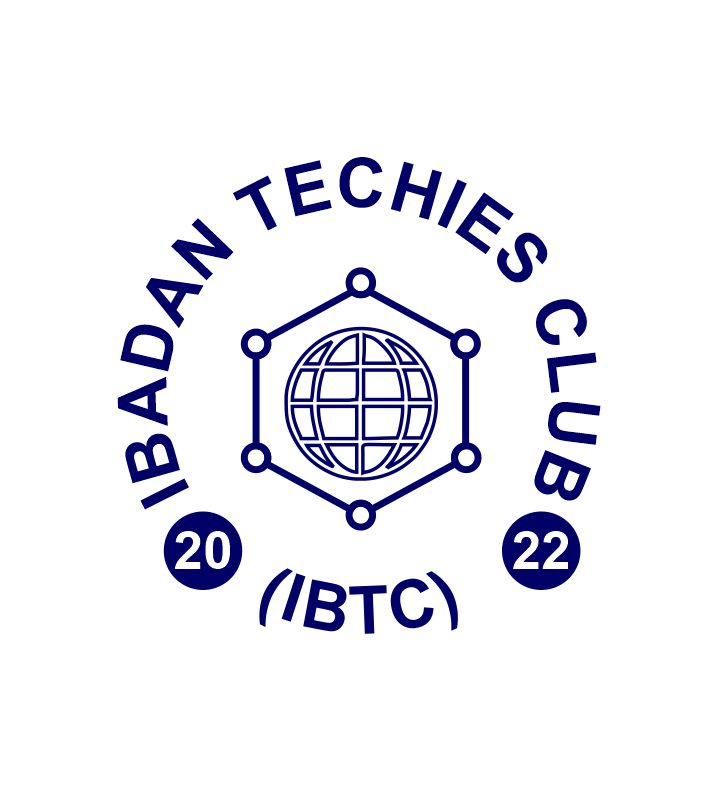

    <picture>
        <source srcset="./docs/logo/logo.avif" type="image/avif">
        
    </picture>
   

# Badtechies &middot; [] 

Badtechies is the first-stop website for Ibadan Techies Club and all its affiliates.

## Prerequisites

To run the project we need the following software binaries installed on our development machines:

- `node>=16.7.0`
- `npm>=8.0.0`

## 🤝 Contributing

We encourage you to contribute to Ibadan Techies! Please check out the [Contributing guide](./docs/contributing/CONTRIBUTING.md) for guidelines about how to proceed.

Opensauced has a commit utility called [@open-sauced/conventional-commit](https://github.com/open-sauced/conventional-commit) that helps you write your commits in a way that is easy to understand and process by others. However, [our contribution guide](./docs/contributing/CONTRIBUTING.md) has enough explanation that may not make the utility useful to you.

_changes will be incrementally added to the README as the repo gets busy. For now, this is what is needed to be useful_

## ⚖️ LICENSE

MIT © [Badtechys](LICENSE)
