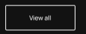
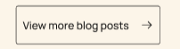

# Button

The Button serves two roles: link and button.
If the props of href is true, it will render as a Link. But if href is false, it will render as a button with a default 'button' type.

## Props

```ts
  href?: string
  outline?: T
  style: {
    color: TString
    border?: T extends true ? TString : never
    background?: T extends boolean ? never : TString
    width: TString
    height: TString
  }
  type?: 'button' | 'submit'
```

### outline Props

This is used to set the button to have outline features as in the images below.




This typically inverts the background, using a transparent one instead of a block background.

### style Props

This is to limit the over use of css for this component. It only exposes the specific styles needed to make changes to this button

### TYPE Props

This enforces that when this component is in button mode that the types are limited to "button" or "submit". In our case, whene type is not specified it defaults to "button".
